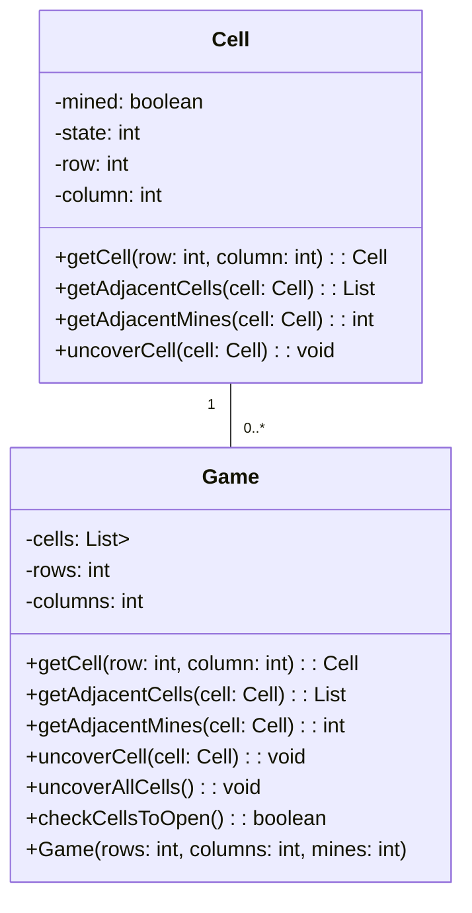

# Minesweeper

## Project Objective

The objective of this project is to develop a game where the player has to find hidden mines in a grid of cells. The
game will provide a hint to the player by indicating the number of mines in the adjacent cells when they uncover a cell.

The goal of the game is to uncover all the cells without mines, without uncovering any cell that has a mine (this will
result in losing the game).

## Requirements

### Specification

The game is based on a 6 x 6 cell matrix (i.e., 6 rows and 6 columns) initially, but the code should be written in such
a way that it can be adapted to any number of rows and columns. At the beginning of the game, a certain number of
mines (initially 8, but this number should also be customizable) will be randomly distributed in the cells, and the
player must find the cells where the mines are hidden.

A cell can be in one of three different states:

- **Covered**: This is the initial state of the cell, and in this state, the player does not know whether there is a
  hidden mine in the cell or not.
- **Marked**: This state is the same as the previous one, but the player has marked the cell to indicate that they think
  there is a mine in that cell.
- **Uncovered**: If the player opens the cell, it enters this state. If there is a mine in the cell, opening the cell
  will automatically result in losing the game. If there is no mine, the game will show the player how many mines are in
  the adjacent cells. To make the game easier, if the number of adjacent cells is zero, the game will automatically open
  all the adjacent cells that are not yet uncovered, as we know for sure that there are no mines in them (this
  functionality will not be implemented in the first phase of the project).

The player wins if they manage to uncover all the cells without mines. At each moment in the game, we must show the
board to the player, so they can see the uncovered cells and the ones that are still covered.

### Classes to Implement

The implementation of the game will be based on the following two classes:

#### `Cell` class

This class implements a cell on the board and will include the following attributes:

- `mined`: A boolean that indicates whether the cell contains a mine or not.
- `state`: An integer that indicates the state of the cell. Three constants will be defined in this class to represent
  the different states: `Covered` (1), `Marked` (2), and `Uncovered` (3).
- `row`: The number of the row where the cell is placed.
- `column`: The number of the column where the cell is placed.

#### `Game` class

This class has the following attributes:

- `cells`: The matrix of `Cell` objects.
- `rows`: The number of rows in the matrix.
- `columns`: The number of columns in the matrix.

We only need to add getters for `rows` and `columns` because we cannot change the number of rows and columns once the
game has started.

The `Game` class also includes the following methods:

- `public Cell getCell(int row, int column)`: Returns the cell that is in a specific row and column.
- `private ArrayList<Cell> getAdjacentCells(Cell cell)`: Obtains the list of adjacent cells to the cell received as a
  parameter.
- `public int getAdjacentMines(Cell cell)`: Returns the sum of mines in the adjacent cells to the cell received as a
  parameter. It will use the previous method.

